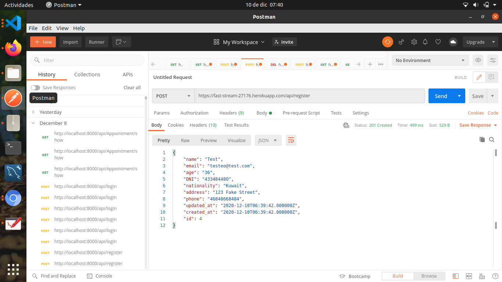
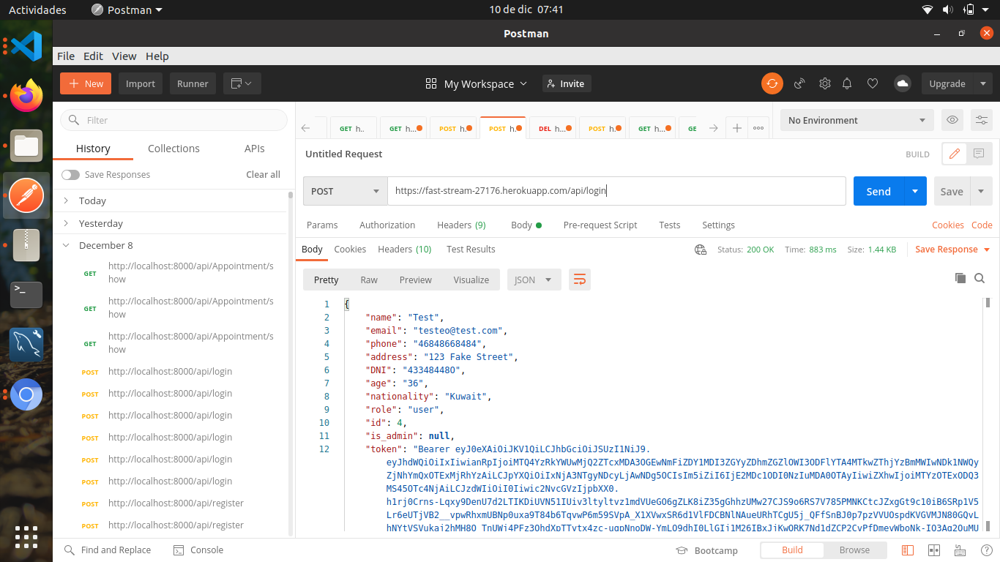
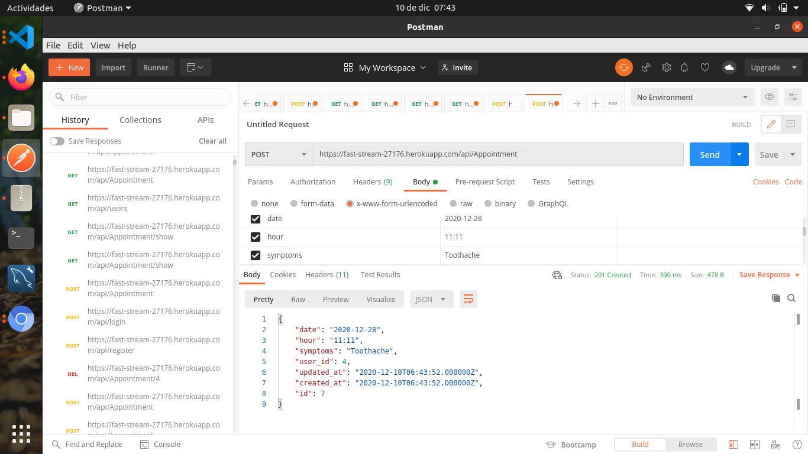
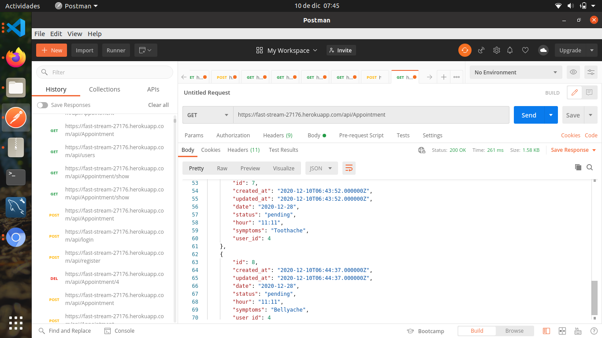
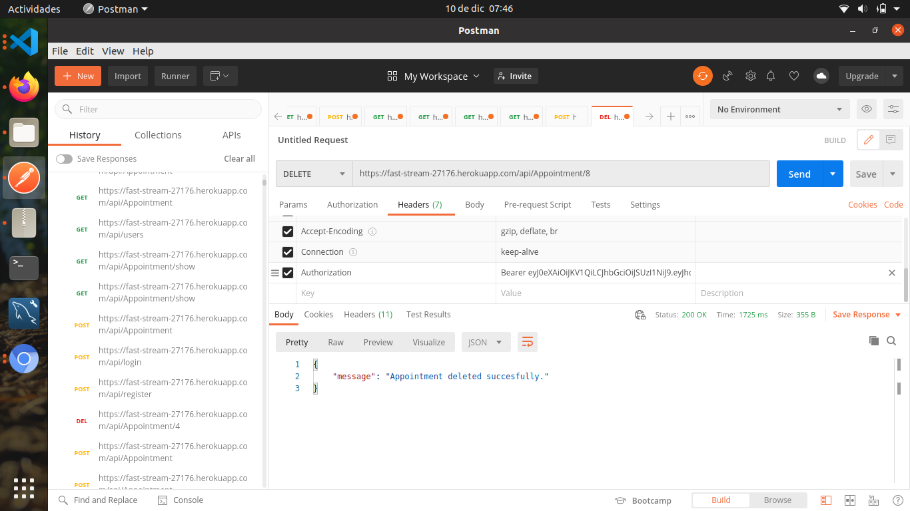

# Laravel-DentalClinicAppointments

## What is Laravel-DentalClinicAppointments ❓

### Laravel-DentalClinicAppointments is an API RESTful created with Laravel, designed to nourish the frontend part of the application.

### You can download the front-end part at https://github.com/Antonini333/frontend-dental-app

## 🔧🔧 Technologies:

- PHP.
- Laravel.
- Artisan.
- Eloquent ORM.
- 0Auth - Laravel/Passport.
- PHPMyAdmin.
- MySQL.
- PostgreSQL.
-Postman
- Git.
- GitHub.
- Heroku.

# Getting Started

## Choose:

You can test the endpoints with the deployed app URL **(https://fast-stream-27176.herokuapp.com/)** or download the code, open it on vsCode and run it.
   
## Tables:

This project it's have been made out with only two tables in origin: User and Appointments. The tables are linked with a foreignId which assures that each appointment belongs to a certain user.

So the relationships would be: User -> Has many -> Appointments //  Appointments -> Belongs to many -> Users

## Routes ❗
There are several routes created in this API. Below there's an index of the most important, feel free to test!

# Users: 

-  https://fast-stream-27176.herokuapp.com/api/register 🔛 **A new user is registered**  (POST method)

   Required parameters by body to register: "name", "email" and "password"

-  https://fast-stream-27176.herokuapp.com//api/login 🔛 **User logs into his account**  (POST method)

   Required parameters by body to login: "name", "email"
   
-  https://fast-stream-27176.herokuapp.com//api/logout 🔛 **User exits his acccount**  (POST method)

   Required parameters by body to logout: "name", "email"

-  https://fast-stream-27176.herokuapp.com/api/users 🔛 **Show all users** ADMIN (GET method)

-  https://fast-stream-27176.herokuapp.com/api/users/:id 🔛 **Delete a client by his id** (DELETE method)

- https://guarded-scrubland-93096.herokuapp.com/api/logout🔛 **Revoke the user's token** (GET method) 

# Appointments: 

- https://fast-stream-27176.herokuapp.com/api/Appointment 🔛 **User can make a new appointment** (POST method) 

  Required parameters by body: "date", "symptoms", "hour".

- https://fast-stream-27176.herokuapp.com/api/appointment/INSERT-ID-HERE 🔛 **User can cancel an appointment previously made** (DELETE method)

- https://fast-stream-27176.herokuapp.com/api/Appointment/show 🔛 **User can see his already created appointments** (GET method) 

- https://fast-stream-27176.herokuapp.com/api/Appointment 🔛 **Show all appointments of all users** ADMIN (GET method)

# Screenshots:

## SIGN UP
 
  
 
## LOG IN
 
   
  
 
## CREATE APPOINTMENT
 

## CHECK APPOINTMENTS

# DELETE APPOINTMENT 

